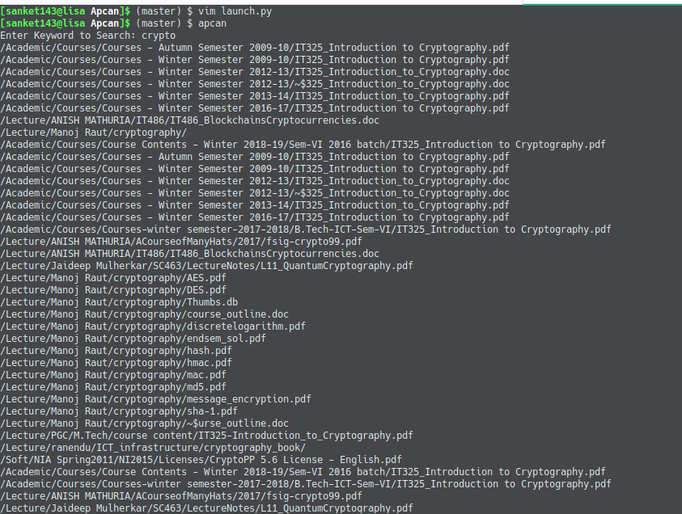
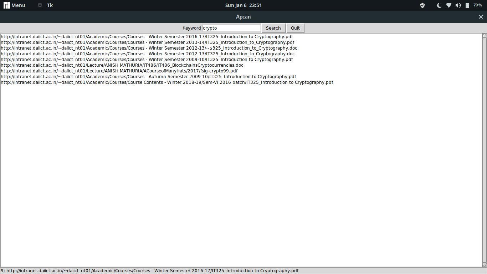

# Apcan

## DAWoC 2018-19 Project Report

Mentor: Roshani

Author: Sanket Chaudhari

GitHub: https://github.com/sanket143/MSTC-WoC-Apcan

1. **Technologies Used**

   - Python Modules

     - requests
     - BeautifulSoup 4
     - Tkinter ( Only for Apcan-GUI)

   - Makefile ( Installer )

2. **Implemented**

   - Graphical Interface for Apcan in Tkinter
     - Have Keyword Entry boy
     - Search Button
     - Quit Button
     - Link list log space
     - Scrollbar
     - Status Bar

3. **Working**

   - Fetches Intranet Source code usign requests
   - Parses and extract using BS4
   - Tranverses Intranet as Breadth First Search (CLI)
   - Apcan GUI uses threads for folders.
     - Creates new daemon thread for each folder
   - Check for search_query in the file/folder and prints
   - Updates status

4. **Idea**

   - Open Link in webbrowser on link

   - Search Engine for DA-IICT Intranet

   - A simple get request could get the content of file formats that stores content simply in text format like .txt, .md and sourMarkdown PDF - Visuce codes. Using Porter Stemmer Algorithm ( May not found very useful for source files because it just have if/else/for/etcs as keywords but still could be applied in the comments of the source code since most of the good source code are documented nicely, some even with copyright licence in the beginning which obviously is very useful information ) to retrieve useful information about the file.

   - We already have an application for Apache Client that we'd be working on, that is [Apron](https://github.com/sanket143/Apron) So could help in the project. Google doesn't go so deep in the fs server.

5. **Issues**

   - While using Apcan GUI, Computer gets blocked ( for sometime ) by the server because of creating so many simultaneous threads on the same address.
   - Apcan GUI uses daemon threads to traverse the files faster and that based on my observations reaches around 435 active threads at the same time resulting into getting blocked.
   - Doesn't take sentences as a search query
   - Only runs one search in one run
   - Its in Python

6. **Difficulty Faced**

   - Creating Graphical Interface
   - Showing search result in GUI
   - handling threads on closing the app while threads are running.

Screenshots

